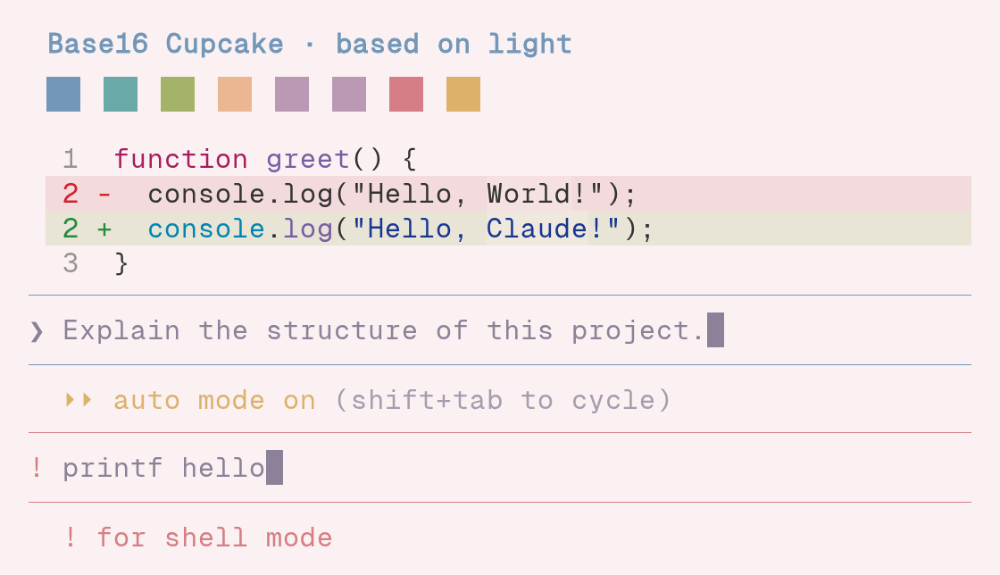
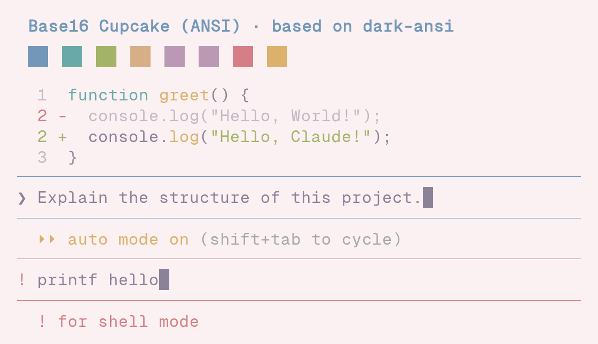
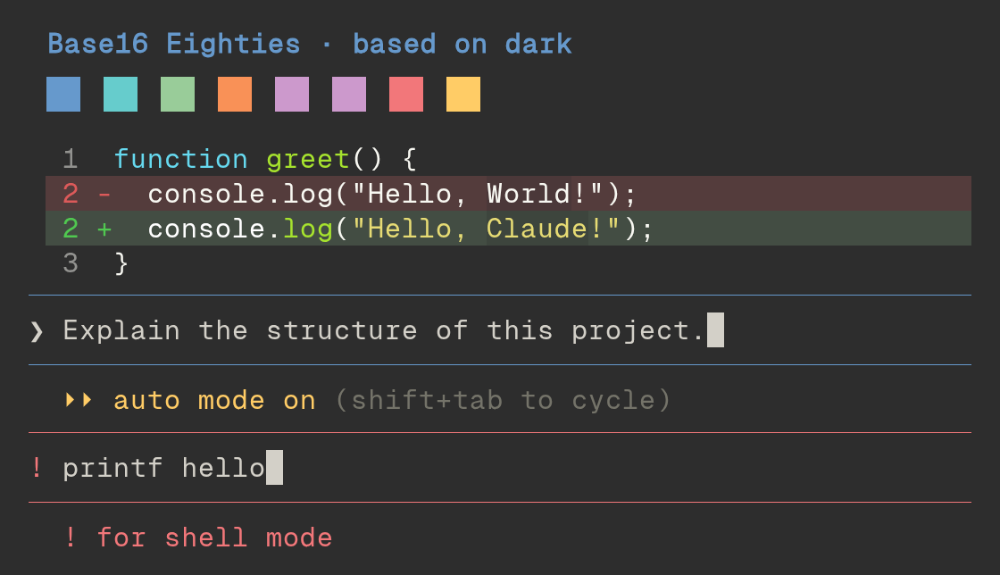
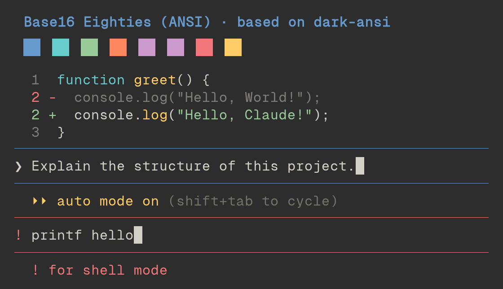
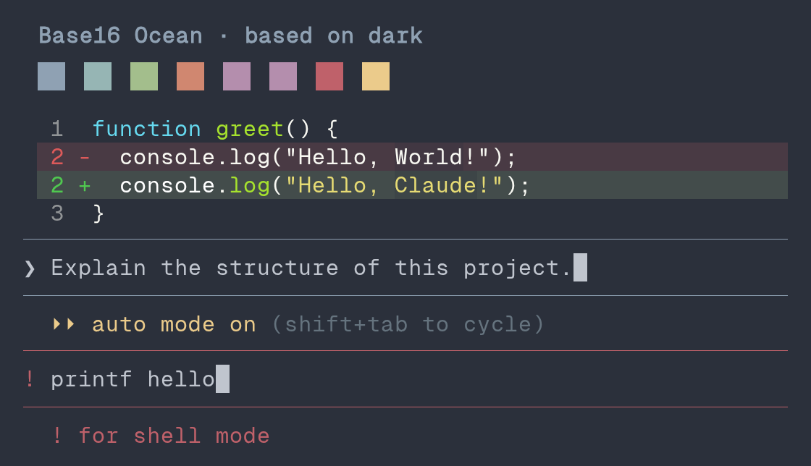
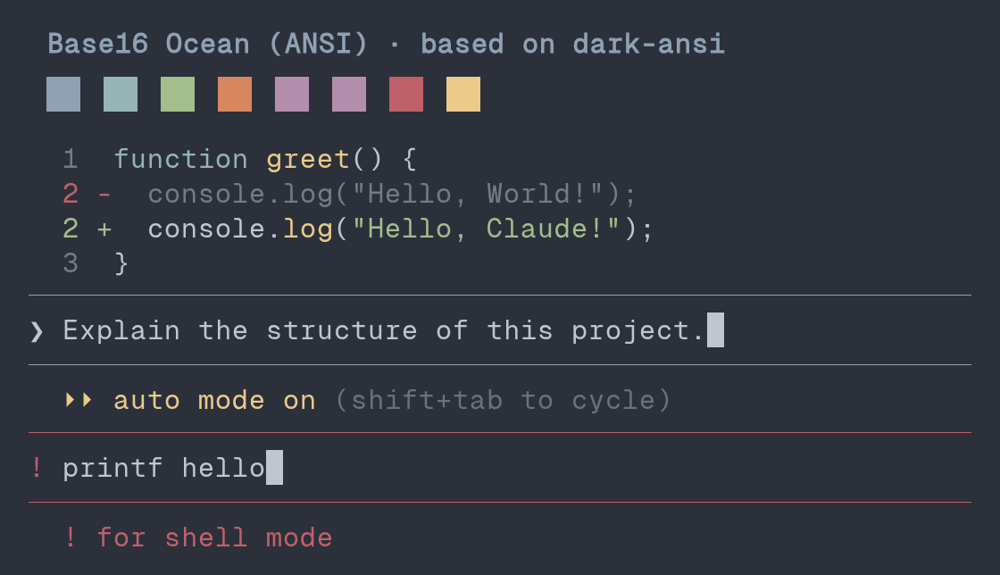

# base16 theme previews

> [!TIP]
> Open a preview for a larger view. Expand **Capture details** for rendering information and palette sources.

## Base16 Cupcake

| Regular | ANSI |
| --- | --- |
|  |  |

Capture details

Combined screenshot crops from **Claude Code 2.1.278**, using **Geist Mono**.

- **Pixels:** Preserved from the original screenshots.
- **Swatches:** Agent colours.
- **Syntax highlighting:** Regular: `GitHub`; ANSI: `ansi`.
- **Examples:** Auto mode and a shell prompt.

[Terminal palette source](https://github.com/tinted-theming/schemes/blob/50f6e3b93a8f62db9d839f8b79a709c1bbdaac53/base16/cupcake.yaml).

## Base16 Eighties

| Regular | ANSI |
| --- | --- |
|  |  |

Capture details

Combined screenshot crops from **Claude Code 2.1.278**, using **Geist Mono**.

- **Pixels:** Preserved from the original screenshots.
- **Swatches:** Agent colours.
- **Syntax highlighting:** Regular: `Monokai Extended`; ANSI: `ansi`.
- **Examples:** Auto mode and a shell prompt.

[Terminal palette source](https://github.com/tinted-theming/schemes/blob/50f6e3b93a8f62db9d839f8b79a709c1bbdaac53/base16/eighties.yaml).

## Base16 Ocean

| Regular | ANSI |
| --- | --- |
|  |  |

Capture details

Combined screenshot crops from **Claude Code 2.1.278**, using **Geist Mono**.

- **Pixels:** Preserved from the original screenshots.
- **Swatches:** Agent colours.
- **Syntax highlighting:** Regular: `Monokai Extended`; ANSI: `ansi`.
- **Examples:** Auto mode and a shell prompt.

[Terminal palette source](https://github.com/tinted-theming/schemes/blob/50f6e3b93a8f62db9d839f8b79a709c1bbdaac53/base16/ocean.yaml).

