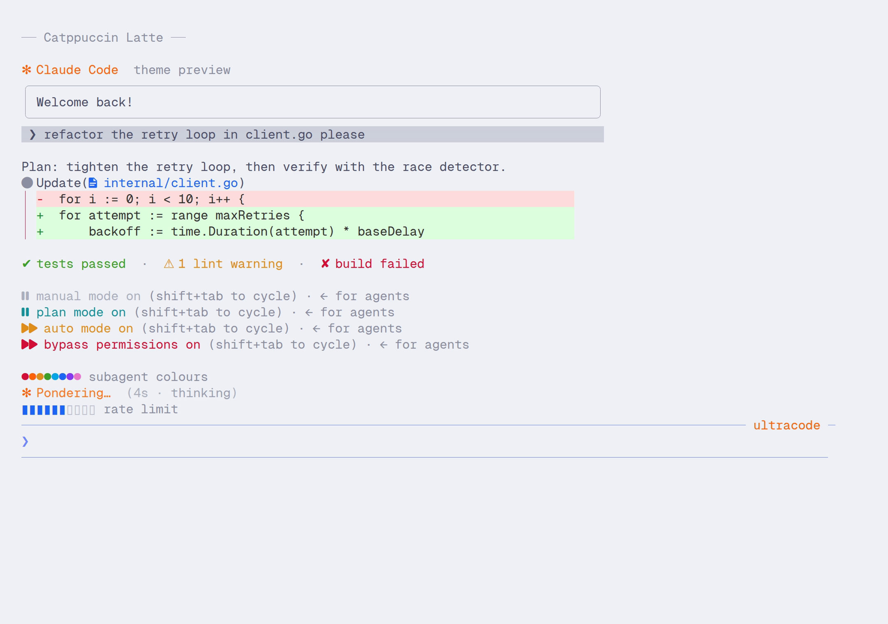
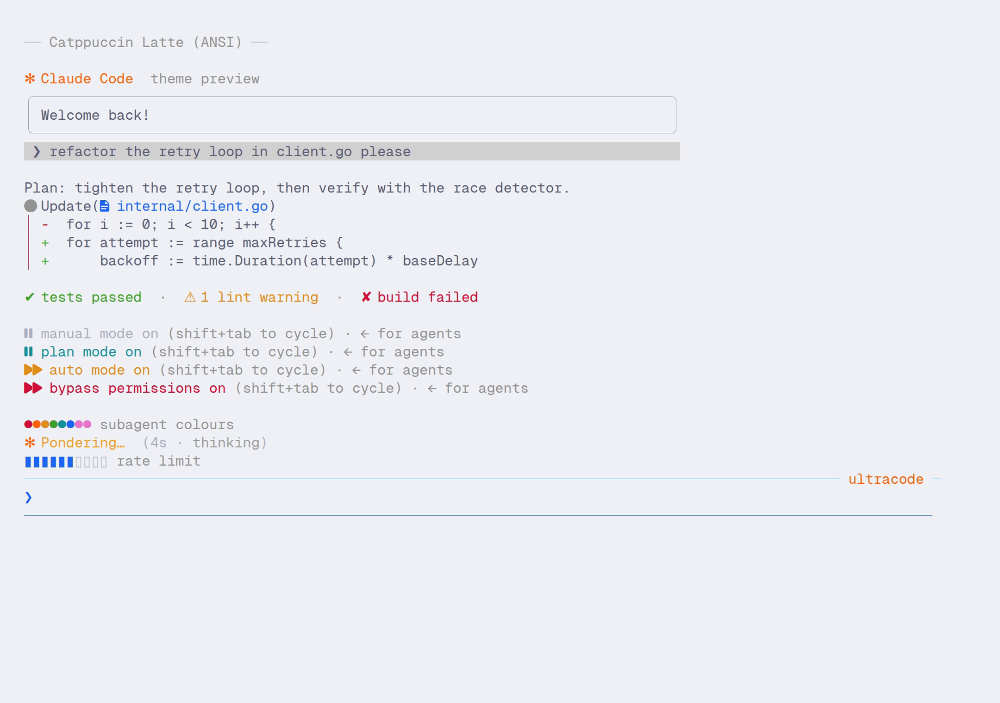
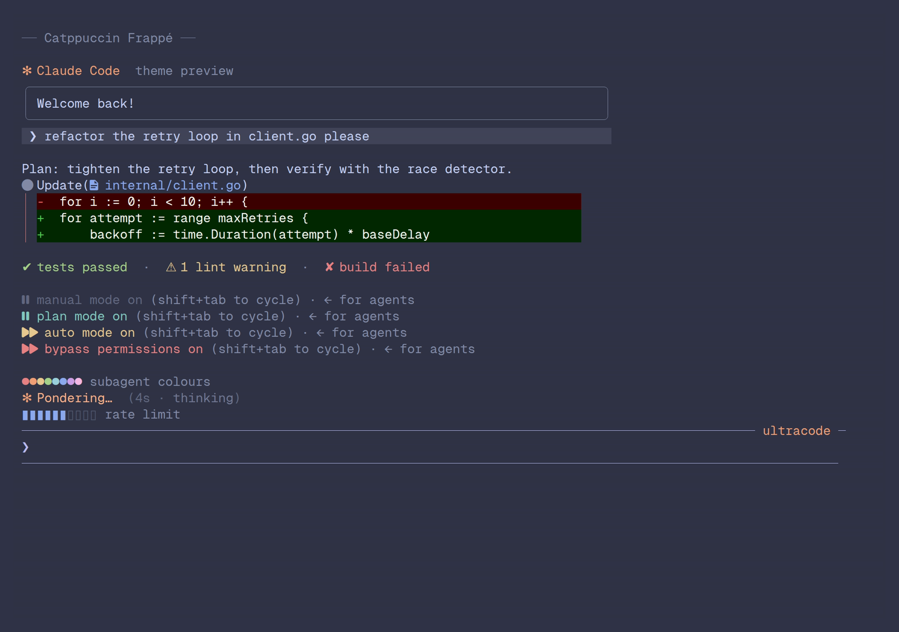
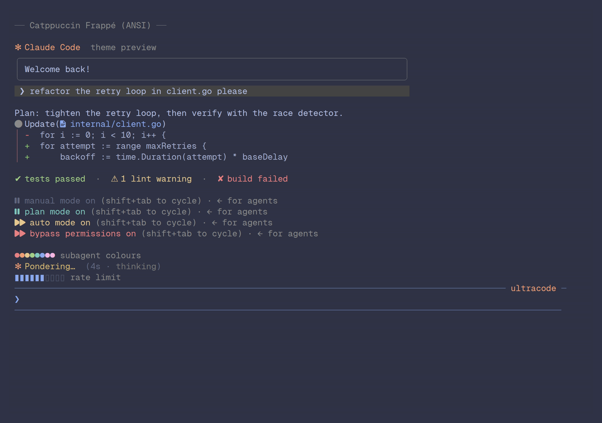
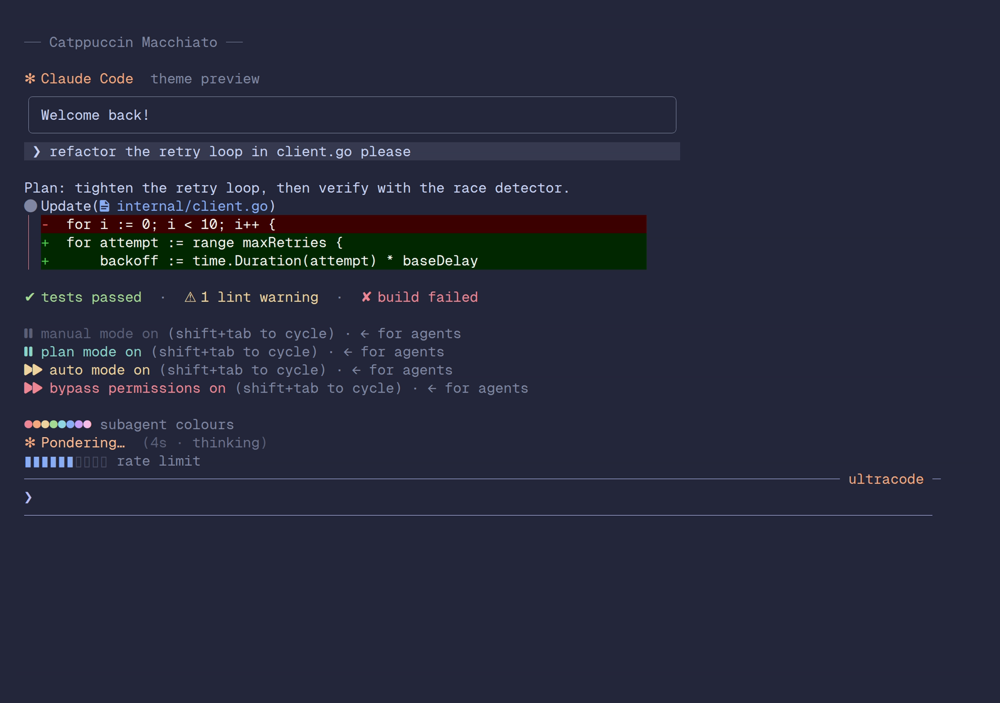
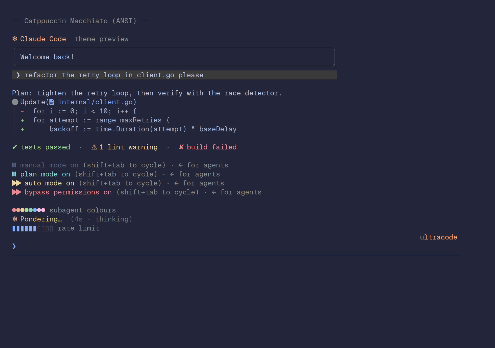
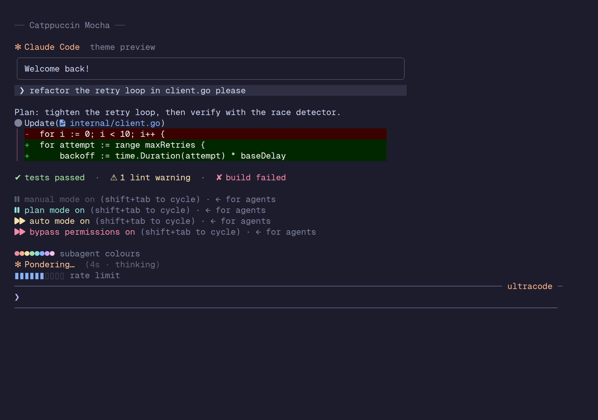
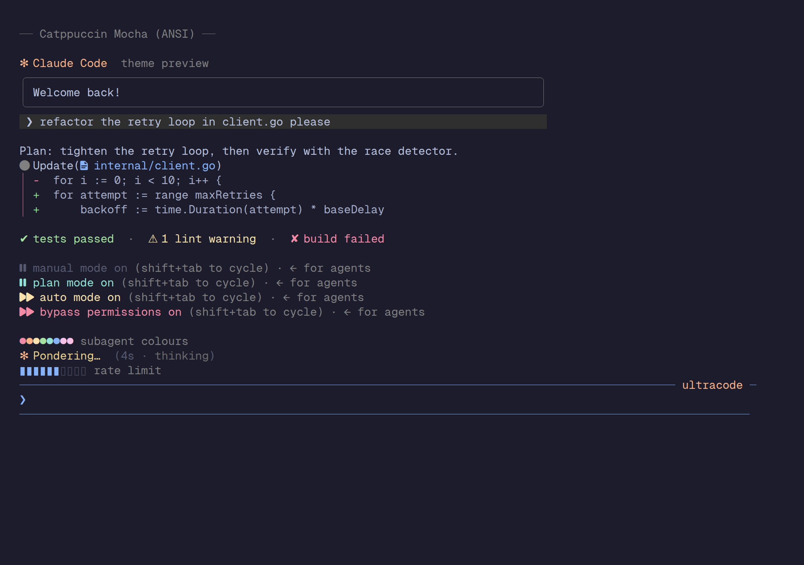

# Catppuccin theme previews

These deterministic renders show the main Claude Code theme roles. They use
GeistMono Nerd Font and the official Catppuccin terminal palettes.

Diffs follow Claude Code's base renderer: GitHub for light themes, Monokai
Extended for dark themes and foreground-only ANSI colours for ANSI themes.
Labels such as `tests passed` and `build failed` are stable token probes, not
literal Claude Code status messages. The eight-dot row is the documented
subagent colour palette, not a literal transcript entry.

## Latte

| Regular | ANSI |
| ------- | ---- |
|  |  |

## Frappé

| Regular | ANSI |
| ------- | ---- |
|  |  |

## Macchiato

| Regular | ANSI |
| ------- | ---- |
|  |  |

## Mocha

| Regular | ANSI |
| ------- | ---- |
|  |  |
