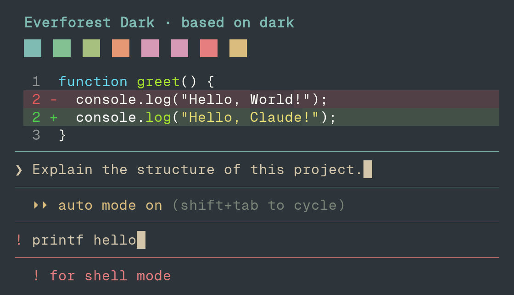
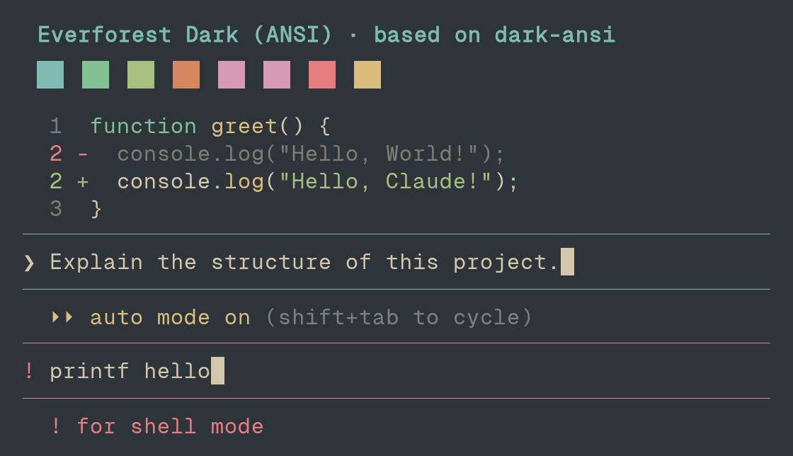
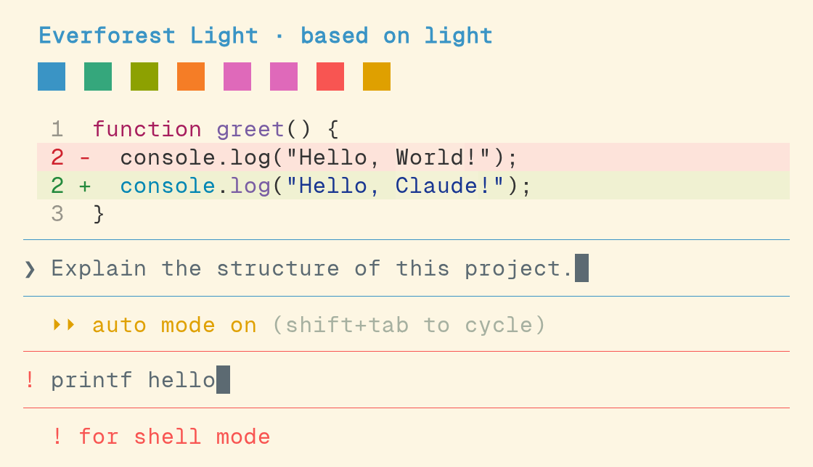
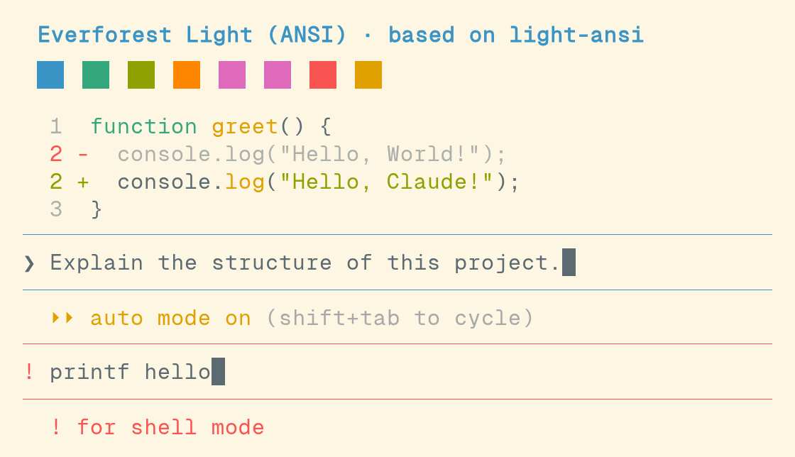

# everforest theme previews

> [!TIP]
> Open a preview for a larger view. Expand **Capture details** for rendering information and palette sources.

## Everforest Dark

| Regular | ANSI |
| --- | --- |
|  |  |

Capture details

Combined screenshot crops from **Claude Code 2.1.278**, using **Geist Mono**.

- **Pixels:** Preserved from the original screenshots.
- **Swatches:** Agent colours.
- **Syntax highlighting:** Regular: `Monokai Extended`; ANSI: `ansi`.
- **Examples:** Auto mode and a shell prompt.

[Terminal palette source](https://github.com/sainnhe/everforest/blob/85a86eb62409e3ec88713bff3d1b9d7374e112e4/colors/everforest.vim).

## Everforest Light

| Regular | ANSI |
| --- | --- |
|  |  |

Capture details

Combined screenshot crops from **Claude Code 2.1.278**, using **Geist Mono**.

- **Pixels:** Preserved from the original screenshots.
- **Swatches:** Agent colours.
- **Syntax highlighting:** Regular: `GitHub`; ANSI: `ansi`.
- **Examples:** Auto mode and a shell prompt.

[Terminal palette source](https://github.com/sainnhe/everforest/blob/85a86eb62409e3ec88713bff3d1b9d7374e112e4/colors/everforest.vim).

