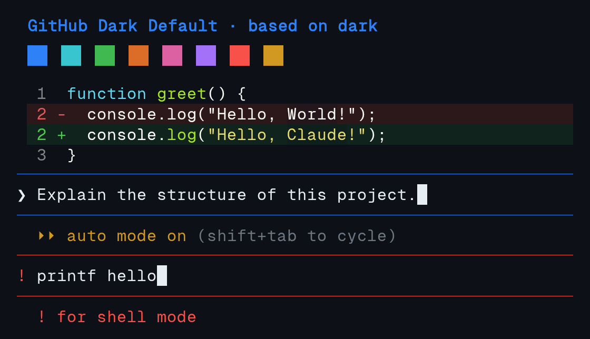
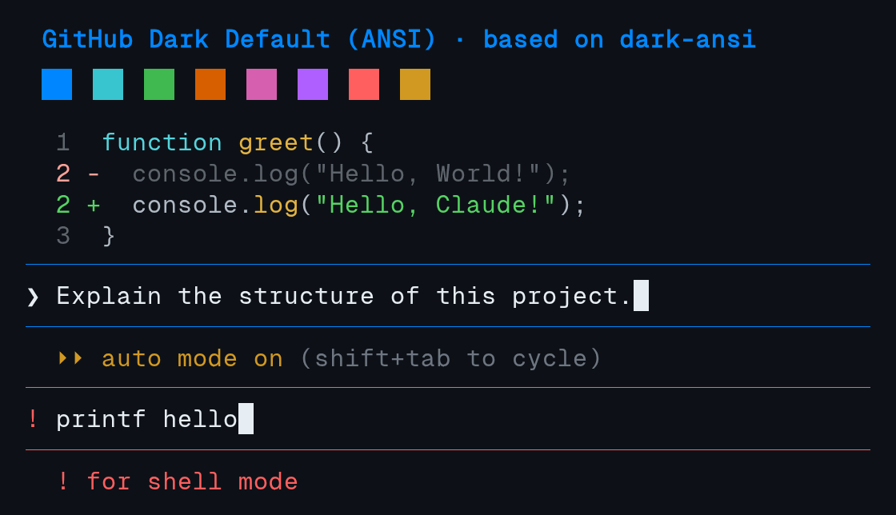
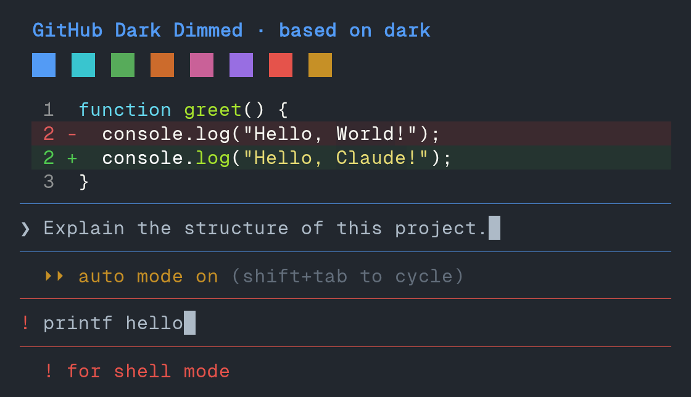
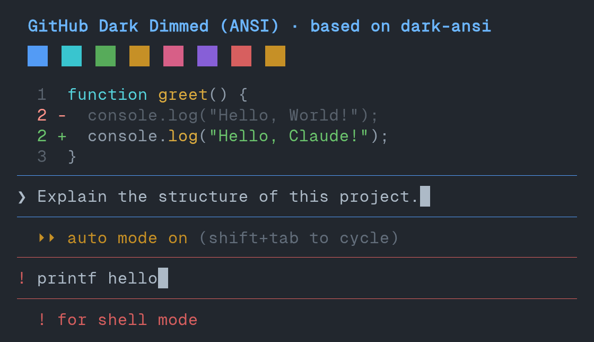
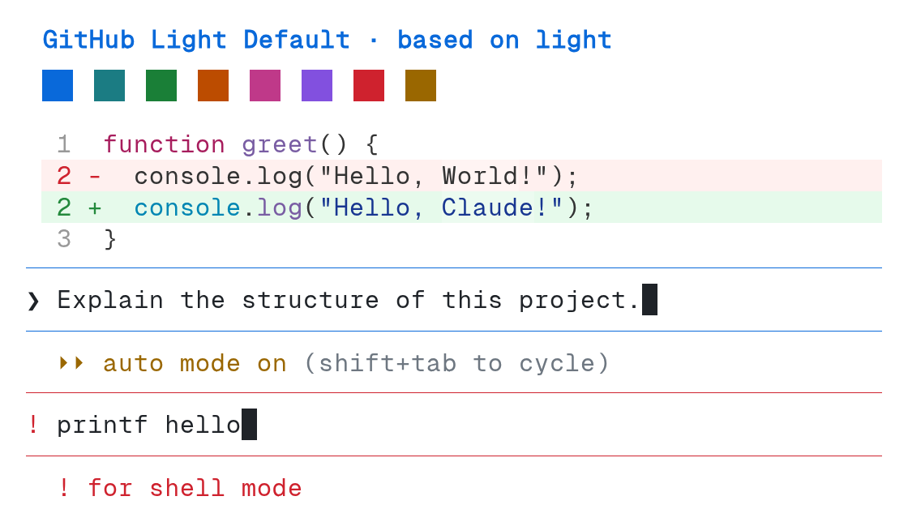
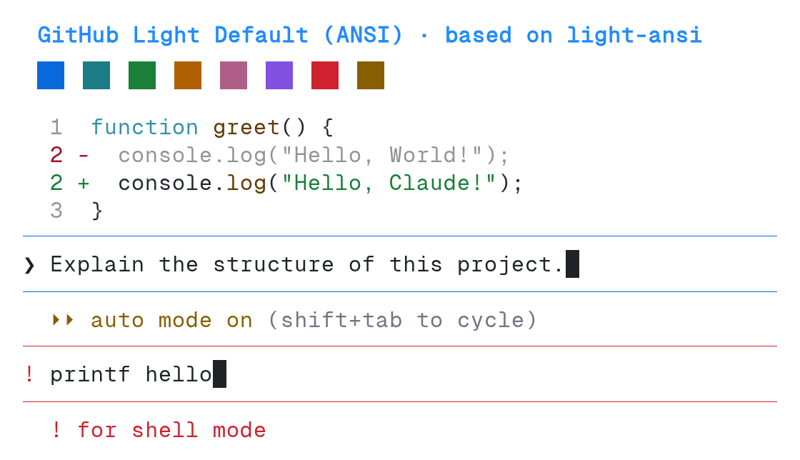

# github theme previews

> [!TIP]
> Open a preview for a larger view. Expand **Capture details** for rendering information and palette sources.

## GitHub Dark Default

| Regular | ANSI |
| --- | --- |
|  |  |

Capture details

Combined screenshot crops from **Claude Code 2.1.278**, using **Geist Mono**.

- **Pixels:** Preserved from the original screenshots.
- **Swatches:** Agent colours.
- **Syntax highlighting:** Regular: `Monokai Extended`; ANSI: `ansi`.
- **Examples:** Auto mode and a shell prompt.

[Terminal palette source](https://github.com/primer/github-vscode-theme/blob/cd78e5e4e7bcf132a6f428ae0f32264bb1b729cf/src/theme.js).

## GitHub Dark Dimmed

| Regular | ANSI |
| --- | --- |
|  |  |

Capture details

Combined screenshot crops from **Claude Code 2.1.278**, using **Geist Mono**.

- **Pixels:** Preserved from the original screenshots.
- **Swatches:** Agent colours.
- **Syntax highlighting:** Regular: `Monokai Extended`; ANSI: `ansi`.
- **Examples:** Auto mode and a shell prompt.

[Terminal palette source](https://github.com/primer/github-vscode-theme/blob/cd78e5e4e7bcf132a6f428ae0f32264bb1b729cf/src/theme.js).

## GitHub Light Default

| Regular | ANSI |
| --- | --- |
|  |  |

Capture details

Combined screenshot crops from **Claude Code 2.1.278**, using **Geist Mono**.

- **Pixels:** Preserved from the original screenshots.
- **Swatches:** Agent colours.
- **Syntax highlighting:** Regular: `GitHub`; ANSI: `ansi`.
- **Examples:** Auto mode and a shell prompt.

[Terminal palette source](https://github.com/primer/github-vscode-theme/blob/cd78e5e4e7bcf132a6f428ae0f32264bb1b729cf/src/theme.js).

