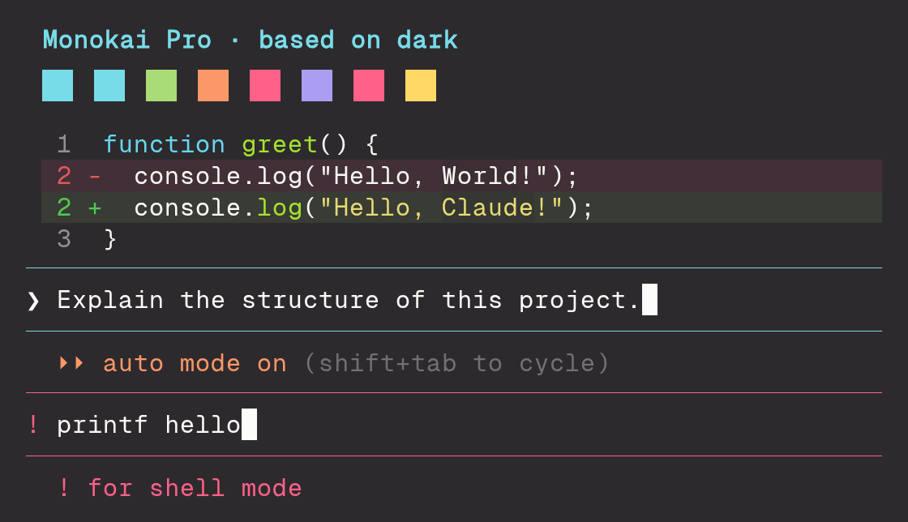
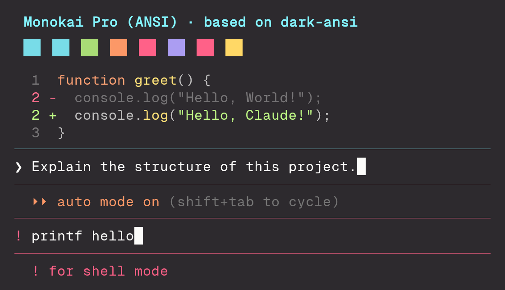

# monokai-pro theme previews

> [!TIP]
> Open a preview for a larger view. Expand **Capture details** for rendering information and palette sources.

## Monokai Pro

| Regular | ANSI |
| --- | --- |
|  |  |

Capture details

Combined screenshot crops from **Claude Code 2.1.278**, using **Geist Mono**.

- **Pixels:** Preserved from the original screenshots.
- **Swatches:** Agent colours.
- **Syntax highlighting:** Regular: `Monokai Extended`; ANSI: `ansi`.
- **Examples:** Auto mode and a shell prompt.

[Terminal palette source](https://github.com/monokai-pro/konsole/blob/df531914171a5b26db0ba11163d80c23e40c7355/Monokai-Pro-CE.colorscheme).

